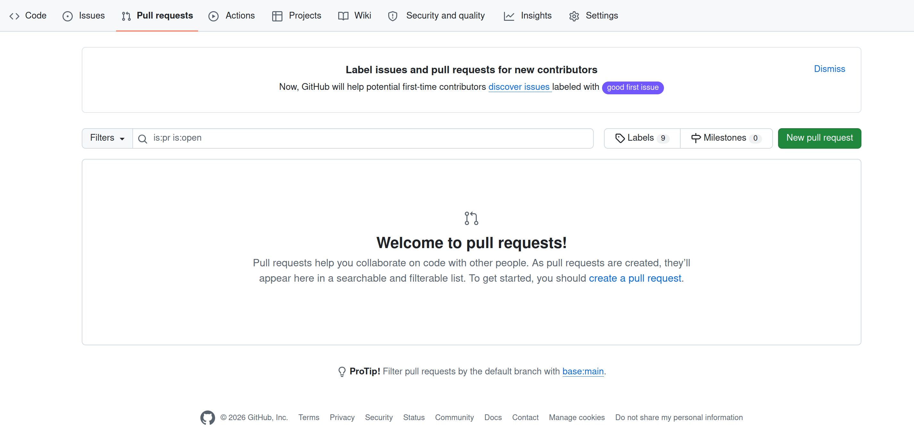
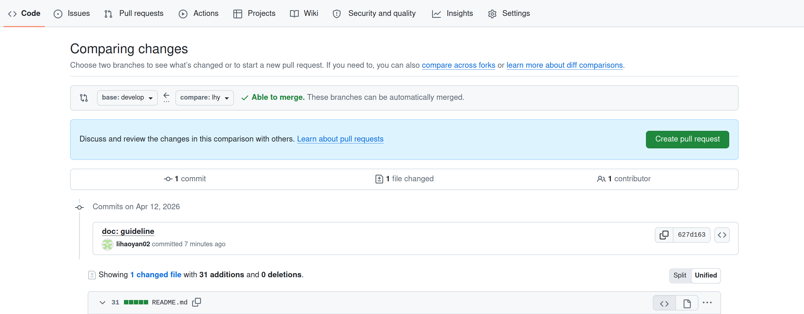

# 2026 China College IC Competition
集成电路创新创业大赛代码仓库

## CPU 测试
    设置环境变量
    $ source set_env.sh
### 运行指定测试
    # riscv 指令测试
    $ cd riscv-tests-am
    $ make run
    # 程序回归测试
    $ cd am-kernels/tests/cpu-tests
    $ make run #可指定程序如：ALL=sum
    # coremark
    $ cd am-kernels/benchmarks/coremark 
    $ make run
## 工作流程及要求

### 代码初始化
    $ git clone git@github.com:lihaoyan02/IC_Competition.git
    # 切换开发分支，拉最新
    $ git checkout develop
    $ git pull origin develop
    # 建立自己分支
    $ cd IC_Competition
    $ git checkout -b [你的分支名字]

### 代码提交
    # 在你自己的分支下
    $ git add .
    $ git commit

    #建议，创建新的分支进行提交
    $ git checkout -b [提交分支] 

    #同步更新 develop
    $ git checkout develop
    $ git pull origin develop

    $ git checkout [提交分支]
    $ git merge develop

    # 解决冲突（如有），测试
    $ git push origin [提交分支]

### 网页提Pull Request
点击 New Pull Request

选择base以及compare, 然后create pull request

## 工具
仿真工具verilator, 波形gtkwave
    [verilator install link](https://verilator.org/guide/latest/install.html)
## 编译说明

### 环境配置
本项目使用 RISC-V 工具链编译，支持 RV32I 指令集。

**编译工具链配置：**
- 默认使用 `riscv64-linux-gnu` 工具链
- 也可以使用 `riscv32-unknown-elf` 工具链（需要修改Makefile中的CROSS_COMPILE）

```bash
# 使用默认工具链
make

# 编译单个测试
make ALL=add

# 清理编译文件
make clean
```

### 编译流程

**编译选项：**
- 架构：RV32I (`-march=rv32i`)
- ABI：ilp32 (`-mabi=ilp32`)
- 优化级别：O2 (`-O2`)
- 不依赖标准库 (`-nostdlib -ffreestanding`)

**生成文件：**
- `.elf` - ELF格式可执行文件
- `.bin` - 二进制文件
- `.txt` - 反汇编代码（包含源码和汇编对应关系）

**文件组织：**
- `src/` - 源文件（包括start.S启动代码和trm.c业务逻辑）
- `test/` - 测试程序
- `build/` - 编译生成的目标文件
- `script/` - 链接脚本（link.ld）

### 验证编译结果
查看反汇编文件了解程序运行逻辑：
```bash
cat build/add.txt  # 查看add程序的反汇编代码
```

